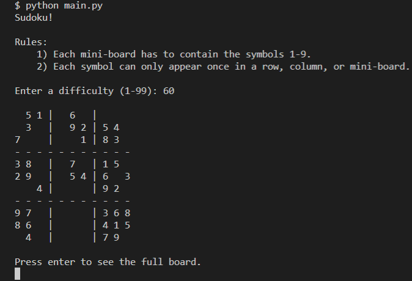

# Sudoku Board Generator

This program generates a Sudoku puzzle board based off the rules of Sudoku.

Rules:
1. Each mini-board has to contain the symbols 1-9.
2. Each symbol can only appear once in a row, column, or mini-board.

Special thanks to the answer by Alain T in [this post](https://stackoverflow.com/questions/45471152/how-to-create-a-sudoku-puzzle-in-python "Stack Overflow").

Make sure [Python](https://www.python.org/downloads/ "Download Python from www.python.org") is installed on your device before opening this file.

## Credits

Alex Akoopie - Creator